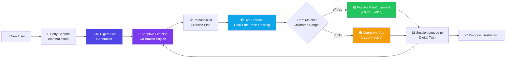
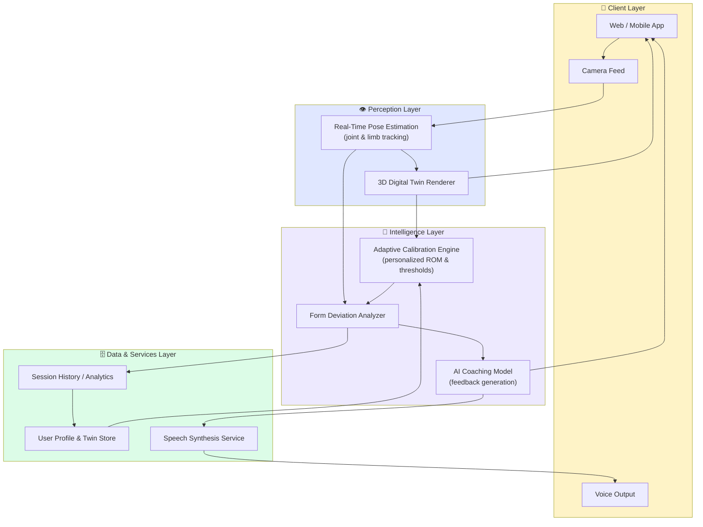
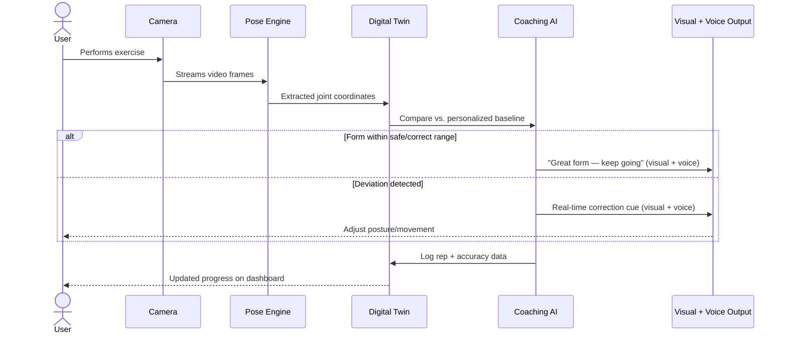
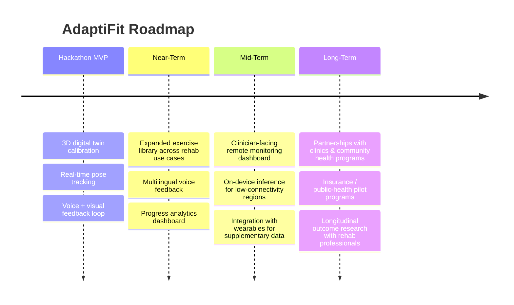

<div align="center">

# 🧠🏃‍♀️ AdaptiFit
### AI-Powered Adaptive Physiotherapy — A Digital Twin That Moves With You

**High-quality adaptive coaching shouldn't depend on being in the right room. It should depend on showing up — and we'll meet you there.**

[](https://github.com/t-haaggarwal_microsoft/Intern-Hackathon-Project-2026-MS)
[]()
[]()
[]()

check it out here https://adaptxfit.netlify.app/

<br/>


[Overview](#-executive-summary) · [The Problem](#-the-problem) · [Our Solution](#-our-solution) · [How It Works](#-how-it-works) · [Architecture](#-system-architecture) · [Features](#-key-features) · [Tech Stack](#-tech-stack) · [Impact](#-impact--why-this-matters) · [Roadmap](#-roadmap) · [Team](#-team)

</div>

---

## 📋 Executive Summary

**AdaptiFit** is an AI-powered adaptive physiotherapy and inclusive fitness platform that builds a **personalized 3D digital twin** of a user's body and mobility range, uses it to **calibrate exercises to that specific person** — not a generic "average" body — and then delivers **real-time, dual-modality (visual + voice) coaching** while the user moves, replicating the responsiveness of an in-room physiotherapist through nothing more than a camera-equipped device.

We built AdaptiFit for the **Social Good & Inclusivity** track because physical rehabilitation and adaptive movement support sit at one of healthcare's sharpest access fault lines: the people who most need consistent, correctly-guided movement are disproportionately the people least able to reach it — due to cost, geography, disability, or simply not having anyone available to watch and correct their form.

> 🖼️ *Add product screenshot / GIF of the 3D digital twin + live monitoring UI here*

---

## 🩺 The Problem

Rehabilitation and adaptive exercise access is a **global-scale, underappreciated healthcare gap**:

- According to the World Health Organization and the Global Burden of Disease study, roughly **2.4 billion people worldwide — about one in three people on the planet** — currently live with a health condition that could benefit from rehabilitation, and that need has grown by more than 60% since 1990.
- In many low- and middle-income countries, **over half of the people who need rehabilitation services never receive them**, largely due to cost, distance, and clinician shortages.
- Musculoskeletal conditions, led by low back pain, are the single largest driver of rehabilitation need worldwide — a problem that is chronic, recurring, and highly dependent on consistent, correctly-performed exercise.
- Adherence is the silent killer of outcomes: clinical research on home-based rehab has repeatedly found that patients complete their prescribed exercises on well under half of their assigned days, and appointment no-show/dropout rates in physiotherapy programs are frequently reported at **50–60%**.
- The common thread across these numbers isn't a lack of willingness to get better — it's the **absence of real-time, personalized, always-available guidance** once the patient leaves the clinic room.

**AdaptiFit exists to close exactly that gap:** the moment between "I have exercises to do" and "I did them correctly, consistently, safely, and with someone (something) watching."

---

## 💡 Our Solution

AdaptiFit replaces the single "one-size-fits-all fitness app" model with a **personalized closed feedback loop**:

1. **See the body as it actually is** — not a generic stick figure, but a 3D digital twin built from the user's own proportions, joint ranges, and physical constraints.
2. **Adapt the exercise to the person**, instead of forcing the person to adapt to a rigid, pre-recorded routine.
3. **Watch in real time** as the user moves, using computer-vision pose tracking.
4. **Correct instantly** through synchronized visual overlays and spoken voice cues — so feedback works whether the user is watching the screen, listening, or both.

This turns a static, easily-abandoned home exercise sheet into a **living, responsive coaching relationship** — available on any device with a camera, with no appointment, no travel, and no cost barrier per session.

---

## ⚙️ How It Works



The loop is continuous: every session refines the digital twin, and every refinement makes the next session's guidance more precise — the system gets to know the user's body better over time, the same way a real physiotherapist would across repeat visits.

---

## 🏗️ System Architecture



### Real-Time Feedback Sequence



> 🖼️ *Add your actual architecture screenshot / Azure resource diagram here if applicable*

---

## ✨ Key Features

| Feature | Description | Why It's Hard / Why It Matters |
|---|---|---|
| 🧍 **3D Digital Twin** | Builds a personalized 3D model of the user's body and range of motion from a short camera-based calibration. | Establishes a *personal* baseline instead of assuming one "ideal" body — the foundation of true inclusivity. |
| 🎯 **Adaptive Exercise Calibration** | Dynamically adjusts exercise thresholds, ranges, and difficulty based on the user's actual mobility and constraints (injury, disability, age, fitness level). | Most fitness apps use fixed, generic form targets that fail anyone outside "average" — this is the opposite. |
| 📹 **Real-Time Motion Monitoring** | Live computer-vision pose tracking compares in-the-moment movement against the calibrated, personalized form. | Requires low-latency inference to feel responsive rather than laggy or delayed. |
| 🗣️ **Dual-Modality Feedback (Voice + Visual)** | Every correction is delivered simultaneously as an on-screen overlay and a spoken voice cue. | Accessible to users with different visual/hearing needs, attention styles, or who aren't looking directly at the screen mid-exercise. |
| ♿ **Inclusivity by Design** | The calibration and feedback thresholds themselves adapt to different body types, disabilities, and mobility ranges — inclusivity isn't a UI theme, it's baked into the model. | Avoids the common failure mode where "adaptive" fitness tech is adaptive in marketing only. |
| 📊 **Progress Intelligence** | Every session updates the digital twin, building a longitudinal record of range-of-motion and form-accuracy improvement. | Turns single sessions into a trend line a user (or their clinician) can actually act on. |
| 🌍 **Zero-Hardware Accessibility** | Runs with just a standard camera-equipped device — no wearables, no specialized clinical equipment, no clinic visit. | Removes the two biggest access barriers: cost and geography. |
| 🛡️ **Safety-First Guardrails** | Built-in disclaimers, pain/discomfort stop-guidance, and clear scope boundaries around what the system is (and isn't) qualified to do. | Responsible AI in a health-adjacent product is non-negotiable — see [Safety & Medical Disclaimer](#️-safety--medical-disclaimer). |

---

## 🆚 How AdaptiFit Is Different

| | Generic Fitness Apps | Wearable-Based Rehab Tech | In-Person Physiotherapy | **AdaptiFit** |
|---|:---:|:---:|:---:|:---:|
| Personalized to individual body/mobility | ❌ | ⚠️ Partial | ✅ | ✅ |
| Real-time form correction | ❌ | ⚠️ Limited | ✅ | ✅ |
| Voice **+** visual feedback | ❌ | ❌ | ✅ | ✅ |
| No specialized hardware required | ✅ | ❌ | ✅ (once there) | ✅ |
| Available anywhere, anytime | ✅ | ⚠️ Partial | ❌ | ✅ |
| Designed for disability/mobility inclusivity | ❌ | ⚠️ Partial | ✅ | ✅ |
| Cost per session | Low | High (hardware) | High | Low |

---

## 🌍 Impact & Why This Matters

- **Addresses a documented global-scale gap.** With ~2.4 billion people worldwide living with a condition that could benefit from rehabilitation — and more than half going unserved in lower-income regions — even a modest improvement in access has outsized real-world reach.
- **Attacks the actual point of failure.** Research on home-based rehabilitation consistently shows that the bottleneck isn't prescribing exercises, it's *adherence and correct execution* once the patient is on their own. AdaptiFit is built specifically around that failure point.
- **Personalization as inclusivity, not a feature flag.** By calibrating to an individual's actual mobility rather than a generic reference posture, AdaptiFit is structurally more usable by people with disabilities, injuries, older adults, and non-"average" body types — the exact populations most often left out of mainstream fitness tech.
- **Scales physiotherapist-quality attention.** A single clinician can only be in one room at a time; a real-time AI coaching loop can be in as many homes as there are cameras.
- **Multi-modal accessibility.** Pairing voice with visual feedback supports users with different sensory needs and doesn't force a single interaction mode.

---

## 🧭 Responsible & Ethical AI

Because AdaptiFit operates in a health-adjacent space, we treat responsible design as a core requirement, not an afterthought:

- **Clear scope boundaries** — AdaptiFit is explicitly a wellbeing/movement guidance tool, not a diagnostic or treatment system (see disclaimer below).
- **Human-in-the-loop by design** — the product is built to complement, not replace, clinicians and physiotherapists; future roadmap includes clinician-facing oversight tools.
- **Bias-aware calibration** — the adaptive calibration engine is explicitly designed to avoid a single "reference body," rather than fine-tuning a generic model and calling it inclusive.
- **Transparent safety messaging** — pain/discomfort stop-guidance and crisis resources are surfaced directly in-product, not buried in terms of service.

---

## 🏗️ Tech Stack

> _Update with your actual implementation — suggested categories below:_

| Layer | Suggested Technologies |
|---|---|
| **Pose / Motion Tracking** | MediaPipe Pose / OpenPose / Azure AI Vision |
| **3D Digital Twin & Rendering** | Three.js / Babylon.js / Unity WebGL |
| **AI / ML** | PyTorch or TensorFlow for deviation/classification models; Azure Machine Learning for training & deployment |
| **Voice Feedback** | Azure AI Speech (Text-to-Speech) / Web Speech API |
| **Frontend** | React + TypeScript |
| **Backend** | Node.js (Express/Fastify) or Python (FastAPI) |
| **Cloud & Infra** | Azure App Service, Azure Blob Storage, Azure Cognitive Services, Azure Cosmos DB |
| **Real-Time Communication** | WebRTC / WebSockets for low-latency video + feedback streaming |

---

## 🚀 Getting Started

```bash
# Clone the repo
git clone https://github.com/t-haaggarwal_microsoft/Intern-Hackathon-Project-2026-MS.git
cd Intern-Hackathon-Project-2026-MS

# Install dependencies
[npm install / pip install -r requirements.txt]

# Configure environment variables
cp .env.example .env
# Add your Azure Speech / Vision / ML keys here

# Run the app
[npm run dev / python app.py]
```

> _Add exact setup steps, required API keys, and minimum system requirements (camera, browser support, etc.) here._

---

## 🎥 Demo

> 🖼️ *Add demo video / GIF link here*
> 🔗 *Add live deployment link, if any*
> 🖼️ *Add screenshots of: (1) digital twin calibration, (2) live session with visual overlay, (3) progress dashboard*

---

## 🗺️ Roadmap



- [ ] Expand exercise library across more rehab/mobility use cases
- [ ] Clinician-facing dashboard for remote monitoring of patient progress
- [ ] Multilingual voice feedback for wider linguistic accessibility
- [ ] On-device inference for low-connectivity / low-bandwidth environments
- [ ] Longitudinal progress analytics tied to the digital twin
- [ ] Pilot partnerships with community health and rehab organizations

---

## ⚠️ Safety & Medical Disclaimer

AdaptiFit provides general inclusive movement and wellbeing guidance only. It does **not** diagnose, treat, cure, or replace professional medical care, and is **not** a substitute for a clinician or physical therapist.

**Stop immediately if you feel pain, dizziness, numbness, or discomfort, and consult a qualified professional for medical, injury, or rehabilitation needs.**

If you're in crisis, call or text the **988 Suicide & Crisis Lifeline**.

---

## 👥 Team

| Name | Role |
|---|---|
| **Ayush Upadhyay** | Owner |
| **Harshit Aggarwal** | Team Member |
| **Krishna Aggarwal** | Team Member |
| **Ridhi Gaur** | Team Member |
| **Sayandeepa Biswas** | Team Member |

---

## 📚 Sources

Global rehabilitation need and adherence figures referenced above are drawn from the World Health Organization / Global Burden of Disease 2019 study (published in *The Lancet*) and peer-reviewed clinical adherence research; see the WHO [Rehabilitation Fact Sheet](https://www.who.int/news-room/fact-sheets/detail/rehabilitation) for the primary global estimate.

---

<div align="center">

**AdaptiFit** — because adaptive coaching should meet you where you are.

*Built for the Microsoft Intern Hackathon 2026 — Social Good & Inclusivity Track*

⭐ *If you believe in inclusive, accessible rehab technology, star this repo!*

</div>
